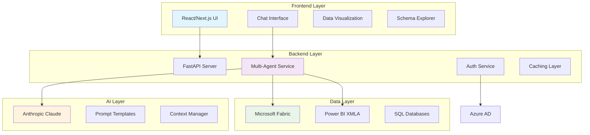
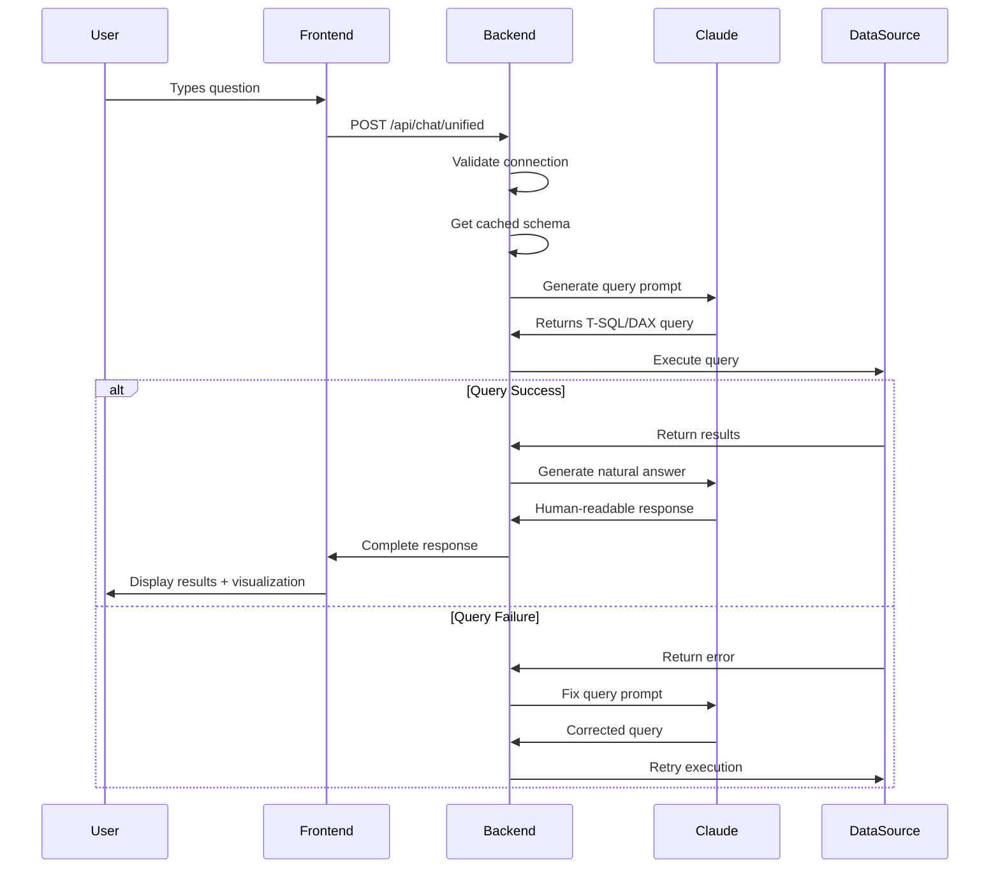
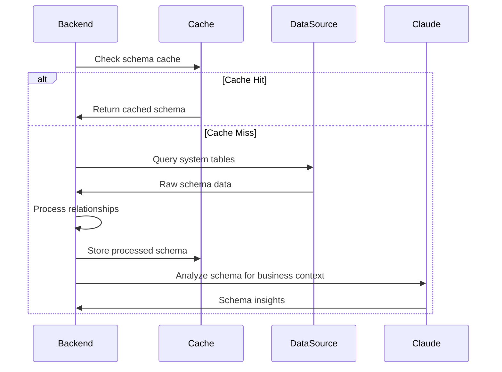
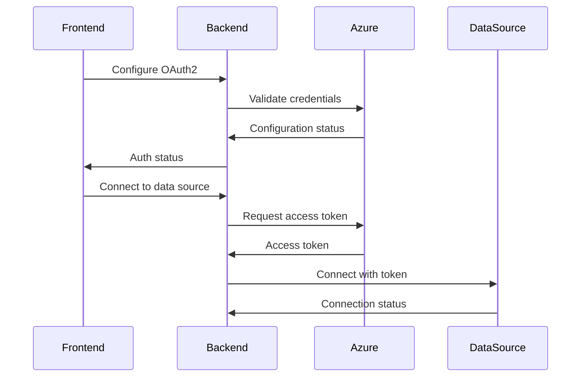

# 🏗️ System Architecture

This document explains the technical architecture of the Chat with Data application, including components, data flow, and design decisions.

## 📋 Overview

The Chat with Data application is built using a modern, scalable architecture that separates concerns into distinct layers:

- **Frontend**: React-based user interface (Next.js)
- **Backend**: Python API server (FastAPI)
- **AI Layer**: Anthropic Claude integration
- **Data Layer**: Microsoft Fabric and Power BI connections
- **Authentication**: Azure AD OAuth2

## 🏛️ High-Level Architecture



## 🔧 Component Architecture

### Frontend Components

#### 1. Main Application (`page.tsx`)
- **Purpose**: Root component orchestrating the entire application
- **Responsibilities**:
  - Connection state management
  - Tab navigation (Chat vs Schema Explorer)
  - Authentication status monitoring
  - Data source type selection

#### 2. Enhanced Chat Interface (`EnhancedChatInterface.tsx`)
- **Purpose**: Core conversational UI component
- **Key Features**:
  - Real-time messaging
  - AI thinking process display
  - Query attempt visualization
  - Data table rendering
  - Auto-generated visualizations
  - Conversation context management

```typescript
interface Message {
  id: number;
  text: string;
  sender: 'user' | 'assistant';
  timestamp: Date;
  query?: string;
  data?: any[];
  thinking?: string[];
  queryAttempts?: QueryAttempt[];
  executionTime?: number;
  queryLanguage?: string;
  success?: boolean;
  visualization?: VisualizationConfig;
}
```

#### 3. Connection Components
- **`FabricConnection.tsx`**: Microsoft Fabric database connection management
- **`PowerBIMCPConnection.tsx`**: Power BI semantic model connection setup
- **`OAuth2Config.tsx`**: Azure authentication configuration

#### 4. Data Visualization (`IntelligentVisualization`)
- **Purpose**: Auto-generates appropriate charts based on data and question context
- **Chart Types**: Bar, Line, Pie, Scatter plots
- **Intelligence**: Analyzes question keywords to recommend chart types

### Backend Services

#### 1. Enhanced Multi-Agent Service (`enhanced_multi_agent_service.py`)

The core orchestration service that manages the entire AI workflow:

```python
class EnhancedMultiAgentService:
    def __init__(self):
        self.sql_schema_cache = None
        self.model_info_cache = None
        self.connection_type = None  # 'sql' or 'semantic_model'
        
        # Advanced caching system
        self.schema_cache = {}
        self.query_similarity_cache = {}
        self.entity_extraction_cache = {}
```

**Key Methods**:
- `answer_with_self_correction()`: Main query processing with retry logic
- `generate_optimized_query()`: AI-powered query generation
- `fix_query()`: Automatic error correction
- `generate_natural_answer()`: Human-readable response generation

**Self-Correction Algorithm**:
```python
async def answer_with_self_correction(self, question: str) -> Dict:
    max_attempts = 3
    for attempt in range(max_attempts):
        query = await self._generate_query(question)
        result = self._execute_query(query)
        
        if result["success"]:
            return self._format_success_response(result)
        elif attempt < max_attempts - 1:
            query = await self._fix_query(query, result["error"])
        else:
            return self._format_error_response(attempts)
```

#### 2. Fabric Service (`fabric_service.py`)

Handles Microsoft Fabric database connections and operations:

```python
class FabricService:
    def __init__(self):
        self.server = None
        self.database = None
        self.connection_string = None
        self.schema_cache = {}
        
    def execute_query(self, query: str, limit: int = 100) -> Dict:
        # Executes T-SQL queries with proper error handling
        
    def discover_schema(self) -> Dict:
        # Discovers database schema and relationships
```

**Key Features**:
- Connection pooling and management
- Schema discovery and caching
- Query execution with timeout handling
- Relationship detection between tables

#### 3. Semantic Model Service (`semantic_model_service.py`)

Manages Power BI semantic model connections via XMLA:

```python
class SemanticModelService:
    def __init__(self):
        self.xmla_endpoint = None
        self.dataset_name = None
        self.connected = False
        self.metadata_cache = {}
        
    def execute_dax_query(self, dax_query: str) -> Dict:
        # Executes DAX queries against Power BI models
```

**Key Features**:
- XMLA endpoint connectivity
- DAX query execution
- Semantic model metadata discovery
- Measure and table relationship mapping

#### 4. Claude Service (`claude_service.py`)

Anthropic Claude AI integration service:

```python
class ClaudeService:
    def __init__(self):
        self.client = anthropic.Anthropic()
        self.model = "claude-3-sonnet-20240229"
        
    async def generate_response(self, prompt: str) -> str:
        # Generates AI responses using Claude
```

#### 5. Auth Service (`auth_service.py`)

Azure AD OAuth2 authentication management:

```python
class AuthService:
    def __init__(self):
        self.tenant_id = None
        self.client_id = None
        self.client_secret = None
        self.token_cache = {}
        
    def get_access_token(self) -> str:
        # Gets Azure AD access tokens
```

## 🔄 Data Flow

### 1. User Query Processing Flow



### 2. Schema Discovery Flow



### 3. Authentication Flow



## 🧠 AI Intelligence Architecture

### Prompt Engineering System

The application uses a sophisticated prompt engineering system with context-aware templates:

#### 1. Query Generation Prompts

**T-SQL Prompt Template**:
```python
SQL_GENERATION_PROMPT = """
You are a Microsoft Fabric T-SQL expert with deep understanding of business data patterns.

CRITICAL REQUIREMENTS:
1. Use ONLY Microsoft Fabric T-SQL syntax
2. ALWAYS include TOP N to limit results
3. Use [square brackets] for names with spaces
4. Handle NULL values properly
5. Use appropriate JOINs based on relationships

SCHEMA CONTEXT:
{schema_context}

CONVERSATION CONTEXT:
{conversation_context}

QUESTION: {question}

Generate ONLY the T-SQL query:
"""
```

**DAX Prompt Template**:
```python
DAX_GENERATION_PROMPT = """
You are a Power BI DAX expert specializing in semantic model queries.

CRITICAL REQUIREMENTS:
1. MUST start with EVALUATE
2. Use 'Table Name'[Column Name] format
3. Use proper DAX functions: SUMMARIZECOLUMNS, CALCULATETABLE
4. NEVER use SQL syntax

MODEL STRUCTURE:
{schema_context}

QUESTION: {question}

Generate ONLY the DAX query:
"""
```

#### 2. Self-Correction Prompts

```python
ERROR_CORRECTION_PROMPT = """
You are a {query_language} debugging expert. Fix this failed query:

SCHEMA:
{schema_context}

FAILED QUERY:
{failed_query}

ERROR MESSAGE:
{error}

Provide ONLY the corrected query:
"""
```

### Context Management

The system maintains conversation context to handle follow-up questions:

```python
class ContextManager:
    def __init__(self):
        self.conversation_history = []
        self.query_cache = {}
        self.entity_cache = {}
        
    def add_context(self, question: str, query: str, results: Dict):
        context_entry = {
            "question": question,
            "query": query,
            "timestamp": datetime.now(),
            "row_count": len(results.get("data", []))
        }
        self.conversation_history.append(context_entry)
```

## 🔧 Performance Optimizations

### 1. Caching Strategy

**Multi-Level Caching**:
- **Schema Cache**: Database/model structure (TTL: 1 hour)
- **Query Similarity Cache**: Similar queries and results (TTL: 30 minutes)
- **Token Cache**: Authentication tokens (TTL: as per Azure AD)

**Cache Implementation**:
```python
class CacheManager:
    def __init__(self):
        self.schema_cache = {}
        self.query_cache = {}
        self.similarity_threshold = 0.8
        
    def get_similar_query(self, question: str) -> Optional[Dict]:
        for cached_q, result in self.query_cache.items():
            similarity = self._calculate_similarity(question, cached_q)
            if similarity > self.similarity_threshold:
                return result
        return None
```

### 2. Connection Management

**Connection Pooling**:
```python
class ConnectionPool:
    def __init__(self, max_connections=10):
        self.pool = Queue(maxsize=max_connections)
        self.max_connections = max_connections
        
    def get_connection(self):
        if self.pool.empty():
            return self._create_connection()
        return self.pool.get()
```

### 3. Query Optimization

**Automatic Query Limits**:
- T-SQL queries automatically include `TOP N` clauses
- DAX queries use `TOPN()` function when appropriate
- Configurable row limits (default: 1000 rows)

**Execution Timeouts**:
- Query timeout: 30 seconds
- AI response timeout: 45 seconds
- Connection timeout: 10 seconds

## 🔒 Security Architecture

### 1. Authentication & Authorization

**OAuth2 Flow**:
- Azure AD integration for secure authentication
- Token-based authorization for data access
- Refresh token management

**Permission Levels**:
- **Read Access**: Query data and schema
- **Admin Access**: Configure connections and settings

### 2. Data Security

**Query Validation**:
```python
def validate_query(query: str, query_type: str) -> bool:
    dangerous_keywords = ["DROP", "DELETE", "UPDATE", "INSERT", "TRUNCATE"]
    
    if query_type == "sql":
        return not any(keyword in query.upper() for keyword in dangerous_keywords)
    elif query_type == "dax":
        return query.strip().upper().startswith("EVALUATE")
```

**Input Sanitization**:
- SQL injection prevention
- Query parameterization
- Input length limits

### 3. Network Security

**CORS Configuration**:
```python
app.add_middleware(
    CORSMiddleware,
    allow_origins=["http://localhost:3000"],
    allow_credentials=True,
    allow_methods=["GET", "POST"],
    allow_headers=["*"],
)
```

## 📊 Monitoring & Observability

### 1. Logging Architecture

**Structured Logging**:
```python
logger.info("Query executed", extra={
    "query_type": "sql",
    "execution_time": 1.23,
    "row_count": 150,
    "user_id": "user123",
    "success": True
})
```

### 2. Performance Metrics

**Key Metrics Tracked**:
- Query execution time
- AI response time
- Cache hit rates
- Error rates
- User activity patterns

### 3. Health Checks

**Health Endpoint**:
```python
@app.get("/health")
async def health_check():
    return {
        "status": "healthy",
        "claude_available": claude_service.is_available(),
        "connections": {
            "fabric": fabric_service.is_connected(),
            "powerbi": semantic_model_service.is_connected()
        }
    }
```

## 🚀 Scalability Considerations

### 1. Horizontal Scaling

**Stateless Design**:
- No server-side session storage
- Token-based authentication
- Cacheable responses

### 2. Database Connections

**Connection Pooling**:
- Configurable pool sizes
- Connection lifecycle management
- Health monitoring

### 3. AI Service Integration

**Rate Limiting**:
- API call throttling
- Queue management for high load
- Fallback strategies

## 🔮 Future Architecture Enhancements

### 1. Microservices Migration

**Planned Services**:
- Authentication Service
- Query Engine Service
- AI Orchestration Service
- Data Connection Service
- Analytics Service

### 2. Advanced Caching

**Redis Integration**:
- Distributed caching
- Session storage
- Real-time notifications

### 3. Enhanced AI Capabilities

**Multi-Model Support**:
- Multiple AI providers
- Model selection based on query type
- A/B testing framework

---

This architecture provides a solid foundation for the Chat with Data application while maintaining flexibility for future enhancements and scalability requirements.
